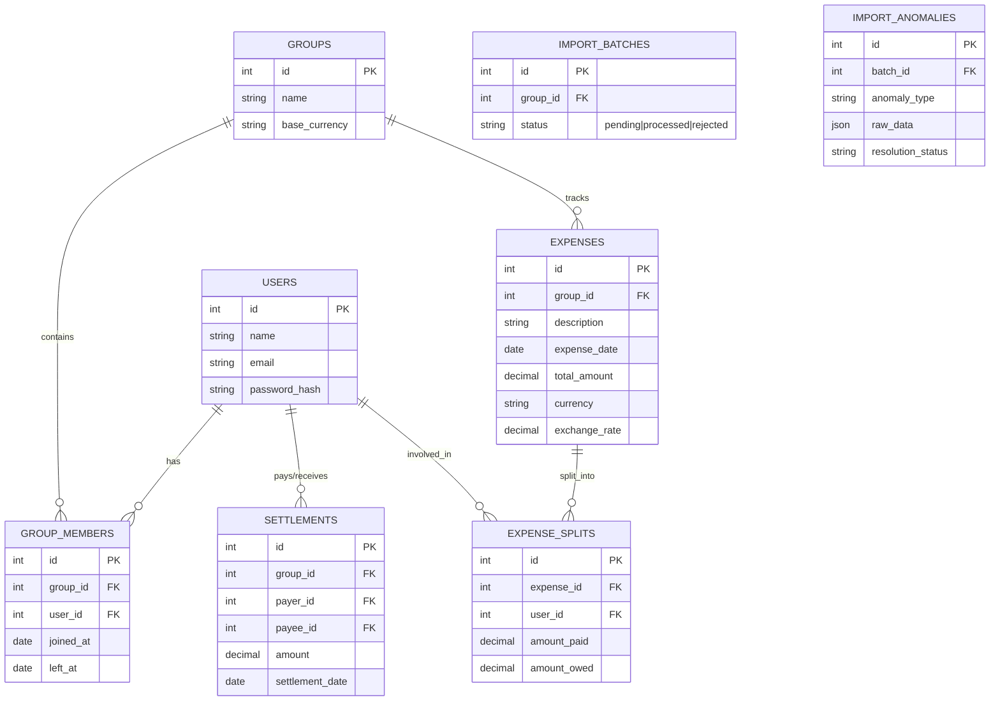

# EquiSplit - Shared Expenses Application target design

## 1. Executive Summary
EquiSplit is a robust web application designed to track shared expenses among flatmates and travel groups. It is specifically architected to handle complex real-world scenarios such as dynamic group memberships (people moving in and out), multi-currency expenses, detailed audit trails, and most importantly, it features a powerful data import pipeline with anomaly detection and user approval workflows to clean up messy legacy data.

## 2. Meeting User Requirements
The application design directly addresses the specific requests of the group members:

*   **Aisha (Simplified Balances - "One number per person"):** 
    *   **Solution:** Implementation of a debt simplification algorithm. While the system tracks every micro-transaction, the primary dashboard will present Aisha with a minimized "Who owes who" view, calculating the fewest number of transactions needed to settle all debts in the group.
*   **Rohan (Audit Trail - "No magic numbers"):** 
    *   **Solution:** A detailed "Ledger" view for each user. Rohan can click on his ₹2,300 balance and see a chronological, itemized list of every expense, split, and settlement that contributes to that exact number.
*   **Priya (Multi-currency - "Dollars vs Rupees"):** 
    *   **Solution:** Native multi-currency support. Expenses can be recorded in their original currency (e.g., USD). The system will maintain exchange rate records (either historical or user-provided per trip) to normalize all balances to a base currency (e.g., INR) for accurate settlements.
*   **Sam (Time-bound Membership - "Moved in mid-April"):** 
    *   **Solution:** Temporal Group Memberships. The `GroupMemberships` table will include `joined_at` and `left_at` dates. By default, the expense splitting logic will only include members who were active on the exact `date` of the expense, ensuring Sam isn't charged for March electricity.
*   **Meera (Approval Workflow for Cleanup - "Approve anything the app deletes"):** 
    *   **Solution:** Interactive Import Pipeline. The CSV import process will not blindly insert or delete data. It acts as an interactive staging area where anomalies are flagged, and the user must explicitly approve resolutions (Merge, Delete, Keep) before any changes hit the core database.

## 3. Core Features (Minimum Product Requirements)
1.  **Authentication:** Secure login and registration module.
2.  **Group Management:** Create groups, invite users, and manage membership timelines (join/leave dates).
3.  **Expense Management:**
    *   Add expenses with date, description, currency, amount, and payer(s).
    *   Support all split types: Equal, Exact Amounts, Percentages, and Shares.
    *   View group-wise balances and individual balance summaries.
4.  **Settlements:** Record payments between users to settle debts.
5.  **Smart CSV Importer:** The core feature for onboarding the legacy spreadsheet.

## 4. Relational Data Model 
The application will use a strict relational database (e.g., PostgreSQL).

## 5. The Data Import Pipeline (Core Requirement)
To handle `expenses_export.csv` and its 12+ deliberate problems, the importer operates in phases:

### Phase 1: Ingestion & Parsing
*   Upload the CSV file.
*   Parse rows into a temporary staging table or memory structure.

### Phase 2: Anomaly Detection Engine (The "Smart" part)
The engine runs rules against the parsed data to find issues:
*   **Duplicate Detection:** Identifies rows with the same date, amount, and similar descriptions.
*   **Format Inconsistencies:** Flags invalid dates, missing currencies, or malformed numbers.
*   **Logical Errors:** 
    *   Negative amounts.
    *   Settlements masquerading as expenses (e.g., description says "paid Sam back").
    *   Splits involving members outside their active dates (e.g., Sam paying for March).
*   **Conflict Detection:** E.g., two people logging the same dinner with slightly different amounts.

### Phase 3: The Review Dashboard (Meera's Phase)
The application pauses and presents an interactive dashboard to the user.
*   **Surface the Problem:** The UI clearly explains each detected anomaly (e.g., "Warning: Negative expense amount detected").
*   **Propose Policies:** The user selects a policy for each issue.
    *   *Negative amount policy options:* "Treat as Refund" (credits payers) OR "Flag as Error/Delete".
    *   *Duplicate policy options:* "Merge into one" OR "Keep both" OR "Delete one".
    *   *Conflict policy options:* "Pick Row A" OR "Pick Row B" OR "Sum amounts".
    *   *Date mismatch policy options:* "Exclude inactive member" OR "Override and include".
*   **Mandatory Resolution:** The import cannot proceed until all anomalies are resolved.

### Phase 4: Commit
Once all anomalies are resolved according to user-selected policies, the standardized, clean data is inserted into the relational tables (`Expenses`, `ExpenseSplits`, etc.).

## 6. Technology Stack
*   **Frontend:** React (Next.js or Vite) with a premium CSS design (vibrant colors, smooth micro-animations, modern typography like 'Inter') to ensure a "WOW" factor.
*   **Backend:** Node.js (Express) or Python (FastAPI).
*   **Database:** PostgreSQL (leveraging transactions to ensure data integrity during complex imports and settlement calculations).

## 7. Development Roadmap (2 Days)
*   **Day 1: Foundation & Engine**
    *   Database schema design and setup.
    *   Core APIs (Auth, Groups, Expenses).
    *   Develop the Import Anomaly Detection Engine (Rule sets).
*   **Day 2: Interface & Polish**
    *   Build Frontend UI components (Dashboard, Ledger, Expense Forms).
    *   Build the crucial Import Review UI for interactive data cleanup.
    *   Testing against the edge cases in the provided CSV.
    *   Final styling and deployment.
